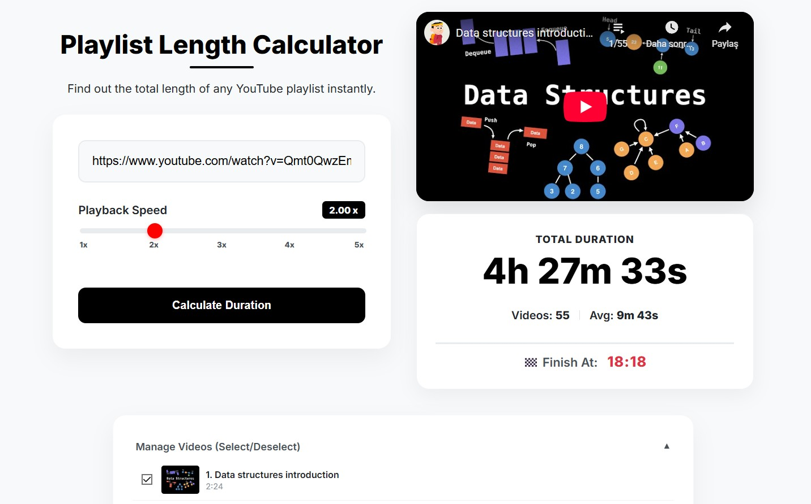

# 📺 YouTube Playlist Length Calculator

<div align="center">
  
  
  <br>
  <h3><a href="https://ytplaylistcalculator.com">View Live Demo 🚀</a></h3>
</div>

<br>

An open-source, ad-free web tool developed by a **Computer Engineering student at Hacettepe University**. It calculates the total duration of any YouTube playlist, allows users to check lengths at custom playback speeds (e.g., 1.5x, 2x), and manage videos to see the remaining time.



## ✨ Features

* **⚡ Instant Calculation:** Fetches data using YouTube Data API v3 to calculate total duration instantly.
* **🎛️ Custom Playback Speed:** Precise control from **1.00x to 5.00x**. See how much time you save by watching faster.
* **🏁 "Finish At" Prediction:** Calculates exactly what time you will finish watching the playlist if you start right now.
* **✅ Advanced Video Management:** Select/Deselect specific videos in the playlist to exclude them from the calculation (perfect for tracking watched videos).
* **🚀 High Performance:** Achieved **100/100** scores on Google Lighthouse for Performance, Accessibility, and SEO.
* **📱 Fully Responsive:** Works perfectly on desktop, tablet, and mobile devices.

## 🛠️ Tech Stack

* **Frontend:** HTML5, CSS3 (Modern Flexbox/Grid), Vanilla JavaScript (No Frameworks)
* **API:** YouTube Data API v3
* **Tools:** Git, VS Code

## 🚀 Installation (Run Locally)

If you want to run this project on your local machine:

1.  **Clone the repository:**
    ```bash
    git clone [https://github.com/ekincimustafa/playlist-calculator.git](https://github.com/ekincimustafa/playlist-calculator.git)
    ```
2.  **Navigate to the project directory:**
    ```bash
    cd playlist-calculator
    ```
3.  **Setup API Key:**
    * Open `script.js`.
    * Replace `const API_KEY = 'YOUR_API_KEY';` with your own YouTube Data API v3 key.
4.  **Run:**
    * Open `index.html` in your browser.

## 👨‍💻 Developer

**Mustafa Ekinci**

* **LinkedIn:** [linkedin.com/in/mustafa-ekinci](https://www.linkedin.com/in/mustafa-ekinci/)
* **Website:** [ytplaylistcalculator.com](https://ytplaylistcalculator.com)

---
*© 2026 All Rights Reserved.*