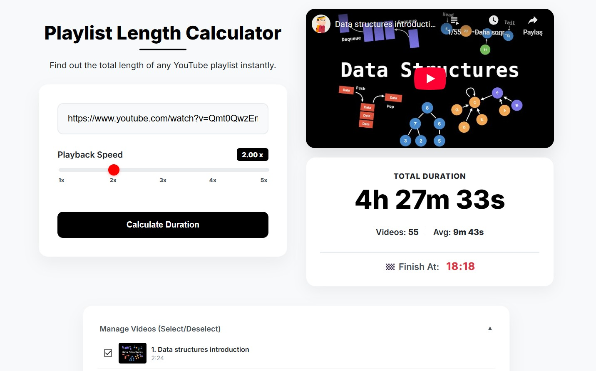

# 📺 YouTube Playlist Length Calculator

<div align="center">

  

  <br><br>

  [](https://ytplaylistcalculator.com)
  [](./extension/)
  [](https://fastapi.tiangolo.com)
  [](LICENSE)

  <h3>
    <a href="https://ytplaylistcalculator.com">🌐 Live Demo</a> &nbsp;·&nbsp;
    <a href="#-chrome-extension-installation">🧩 Chrome Extension</a> &nbsp;·&nbsp;
    <a href="#-installation-run-web-app-locally">⚙️ Local Setup</a> &nbsp;·&nbsp;
    <a href="#-developer">👨‍💻 Developer</a>
  </h3>

  <p><strong>An open-source, ad-free YouTube Playlist Duration Calculator</strong><br>
  Built by a Computer Engineering student at Hacettepe University.</p>

</div>

---

## 📌 About the Project

**YouTube Playlist Length Calculator** was built to solve a simple but frustrating problem: YouTube doesn't tell you how long a playlist is. This tool does exactly that — instantly, for free, with no ads.

Whether you're planning a study session, binge-watching a course, or just curious how long your queue is, this tool gives you a clear answer. It goes beyond a basic total sum by offering playback speed adjustments, per-video management, a "finish at" prediction, and a persistent local history — all without requiring a login or storing any data on a server.

Available both as a **web app** at [ytplaylistcalculator.com](https://ytplaylistcalculator.com) and as a **Chrome Extension** for seamless in-browser use.

---

## ✨ Features

### Core Functionality
- **⚡ Instant Calculation** — Fetches and processes full playlist data in seconds via the YouTube Data API v3, powered by a custom FastAPI backend.
- **🎛️ Custom Playback Speed** — Precise speed control from **0.25x to 5.00x**. See exactly how much time you save watching at 1.5x or 2x.
- **🏁 "Finish At" Prediction** — Enter your start time and instantly know exactly when you'll finish the playlist.
- **✅ Advanced Video Management** — Automatically detects playlist index offsets. Manually select or deselect individual videos to calculate the time for only what you haven't watched yet.

### Browser Extension
- **🧩 Official Chrome Extension** — A lightweight Manifest V3 popup extension. Calculate playlist durations directly from your browser toolbar without leaving the YouTube tab.

### History & Persistence
- **💾 Local History Storage** — Your recent calculations and custom speed preferences are saved entirely in your browser's local storage. No account needed, no data sent to a server.

### Quality & Design
- **🚀 100/100 Lighthouse Score** — Optimized for Performance, Accessibility, Best Practices, and SEO.
- **📱 Fully Responsive** — Clean, dark-mode-ready, minimalist UI that works perfectly on desktop, tablet, and mobile.
- **🔒 Ad-Free & Privacy-First** — No trackers, no ads, no data collection.

---

## 🛠️ Tech Stack

| Layer | Technology | Details |
|-------|------------|---------|
| **Frontend** | HTML5, CSS3, Vanilla JS | No frameworks — pure, fast, and lightweight |
| **Backend** | Python, FastAPI | Handles YouTube API requests securely server-side |
| **API** | YouTube Data API v3 | Fetches video durations and playlist metadata |
| **Extension** | Chrome Extension API | Manifest V3, Local Storage, ActiveTab permission |
| **Hosting** | Render | Automated cron-job keep-alive to prevent cold starts |
| **Version Control** | Git, GitHub | Monorepo structure |

---

## 🏗️ Architecture Overview

```
User Browser
     │
     ▼
┌─────────────────────────┐        ┌──────────────────────────────┐
│   Frontend / Extension  │──────▶ │   FastAPI Backend (Render)   │
│  (HTML + CSS + JS)      │        │   /api/playlist?id=...       │
└─────────────────────────┘        └──────────────┬───────────────┘
                                                   │
                                                   ▼
                                    ┌──────────────────────────┐
                                    │   YouTube Data API v3    │
                                    │   (Google Cloud)         │
                                    └──────────────────────────┘
```

The frontend never exposes API keys to the client. All YouTube API communication is handled server-side through the FastAPI backend, which returns only the processed duration data.

---

## 📂 Project Structure

```
playlist-calculator/
│
├── extension/               # 🧩 Chrome Extension source
│   ├── manifest.json        #    Manifest V3 config
│   ├── popup.html           #    Extension popup UI
│   └── popup.js             #    Extension logic
│
├── index.html               # 🌐 Web app main HTML
├── style.css                # 🎨 Web app styling
├── script.js                # ⚙️  Web app core logic & API integration
│
├── og-image.jpg             # 📸 Open Graph / README screenshot
├── LICENSE
└── README.md
```

---

## 🧩 Chrome Extension Installation

Our official Chrome Extension is **currently pending review** on the Chrome Web Store. In the meantime, you can install it manually in developer mode:

1. **Clone this repository:**
   ```bash
   git clone https://github.com/ekincimustafa/playlist-calculator.git
   ```

2. Open Chrome and go to `chrome://extensions/`

3. Enable **"Developer mode"** using the toggle in the top-right corner.

4. Click **"Load unpacked"** and select the `extension/` folder from this repo.

5. Pin the extension to your toolbar. Navigate to any YouTube playlist page and click the icon!

> ✅ Once approved, it will be available directly from the Chrome Web Store with one-click installation.

---

## 🚀 Installation (Run Web App Locally)

The frontend is pre-configured to call the live FastAPI backend on Render, so you can run it locally with no extra setup:

1. **Clone the repository:**
   ```bash
   git clone https://github.com/ekincimustafa/playlist-calculator.git
   cd playlist-calculator
   ```

2. **Open the app:**

   Simply open `index.html` in your browser, or use a local dev server:
   ```bash
   # With VS Code Live Server, or:
   npx serve .
   ```

> **Want to run the backend locally too?** Check the `/backend` folder for instructions on setting up the FastAPI server with your own YouTube Data API v3 key.

---

## 📊 Performance

Achieved a perfect **100/100** across all Lighthouse categories:

| Category | Score |
|----------|-------|
| ⚡ Performance | 100 / 100 |
| ♿ Accessibility | 100 / 100 |
| ✅ Best Practices | 100 / 100 |
| 🔍 SEO | 100 / 100 |

---

## 🤝 Contributing

Contributions, issues, and feature requests are welcome! Feel free to open an [issue](https://github.com/ekincimustafa/playlist-calculator/issues) or submit a pull request.

1. Fork the project
2. Create your feature branch:
   ```bash
   git checkout -b feature/amazing-feature
   ```
3. Commit your changes:
   ```bash
   git commit -m 'feat: add amazing feature'
   ```
4. Push to the branch:
   ```bash
   git push origin feature/amazing-feature
   ```
5. Open a Pull Request

---

## 👨‍💻 Developer

<div align="center">
  <strong>Mustafa Ekinci</strong><br>
  Computer Engineering Student @ Hacettepe University
  <br><br>

  [](https://www.linkedin.com/in/ekincimustafa/)
  [](https://ytplaylistcalculator.com)
  [](https://github.com/ekincimustafa)
</div>

---

## 📄 License

This project is licensed under the [MIT License](LICENSE).

---

<div align="center">
  <sub>© 2026 YTPlaylistCalculator · Made with ❤️ by <a href="https://github.com/ekincimustafa">Mustafa Ekinci</a></sub>
</div>
